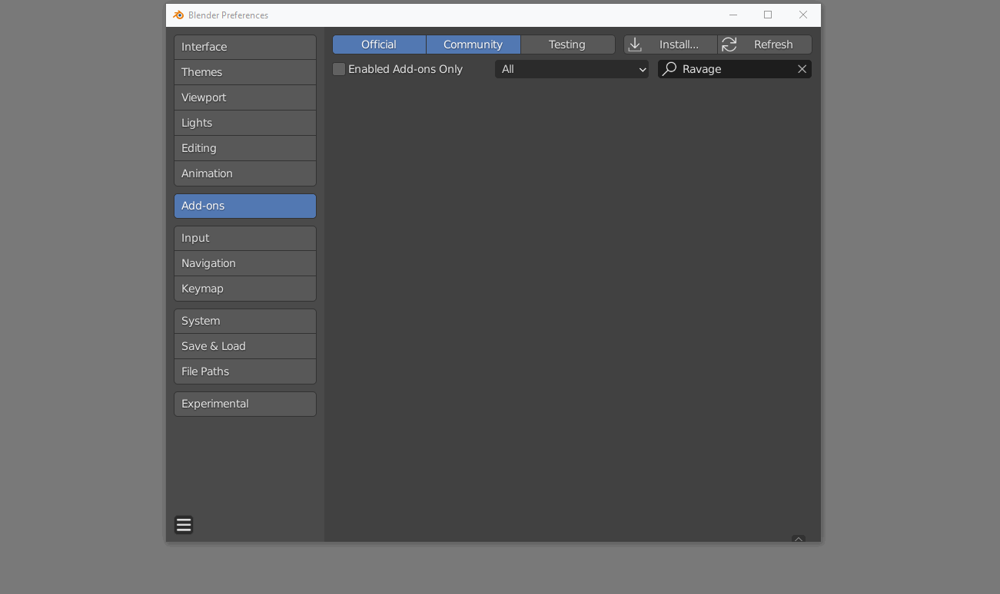

# Introduction

Ravage is a system that streamlines the PBR texturing process inside of Blender. It allows for you to either use your own nodes in the node editor, the system provided by the addon, or a combination of the two for a flexible workflow. It uses a layer based system, simplifying rearranging nodes which can easily become a chore.

The current version of the addon covers the 5 main PBR channels, Albedo, Metallic, Roughness, Normal and Bump. However support for all channels shall be coming in future updates.

The documentation is meant to clarify anything that may have not been clearly understood in the **[video tutorials](https://www.youtube.com/watch?v=116G2Y4vaAI&list=PL5Rm7k-ECx_xwf9lkwvq7h9W2TFO3etT4&index=1)** and to shed light on topics that may not have been covered.

## Important

Before getting started using the addon, we would like to advise on project saving conventions. When creating image textures using the operator on the image nodes or baking textures, a cache folder will be created to store new images and baked maps. We recommend having each Blender project in it's own folder to avoid overwritting any images that may already exist with the same name.

## Updates

You can check for updates on your purchase from **[Gumroad](https://gumroad.com/library)** or **[BlenderMarket.](https://blendermarket.com/account/orders)**

## Installation

Ravage is installed just like any other Blender addon.

-   Ensure the addon is still zipped
-   Open the addon preferences
-   Click on install at the top right corner
-   Locate the .zip file and install the addon

