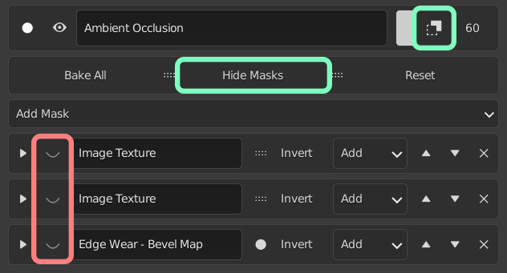

# Known Issues

## Disabling All Masks

Due to the current architecture, turning of all the masks as shown by the red markers below, the result will not be as expected. If you want to disable all masks we recommend using the properties marked in green to hide/reveal all the masks on the layer.

