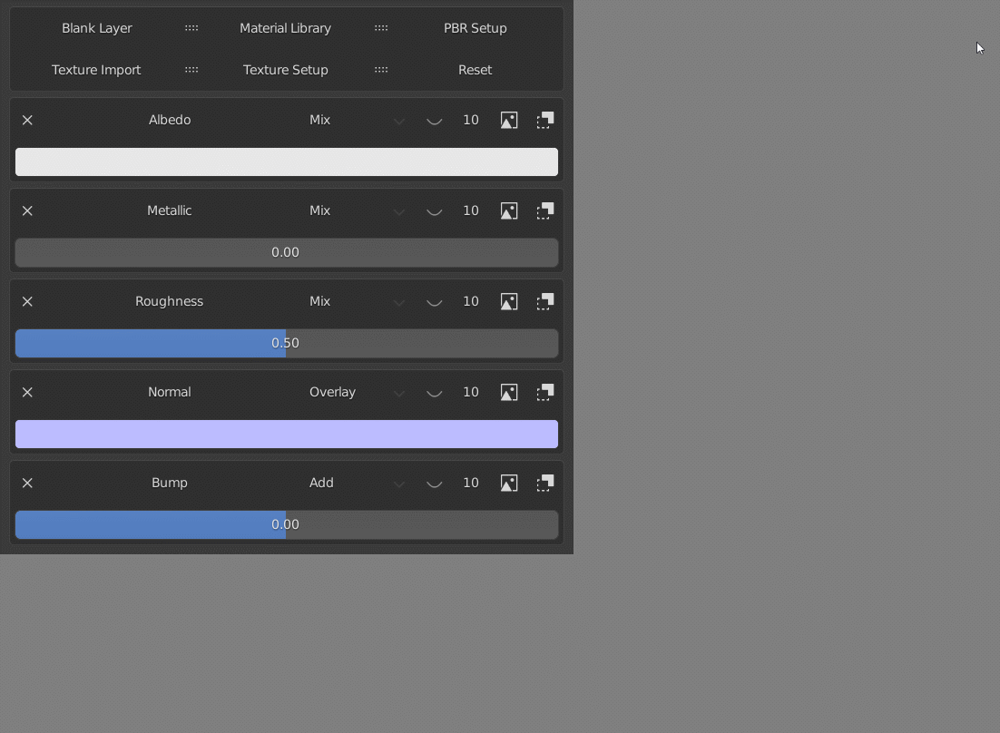

# Material Libraries

You can set up material libraries in the addon preferences. This allows you to easily load materials to you layers. Click **[HERE](./setup.md)** to learn how to add libraries.

You can also set up previews for the libraries. Click **[HERE](./setup_previews.md)** to find out how to do that.

